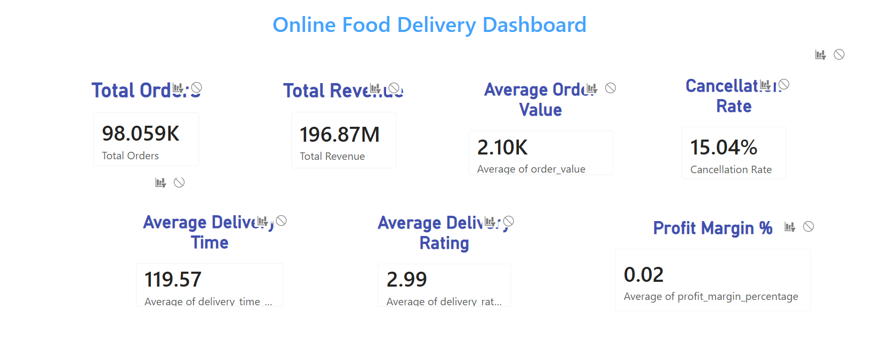
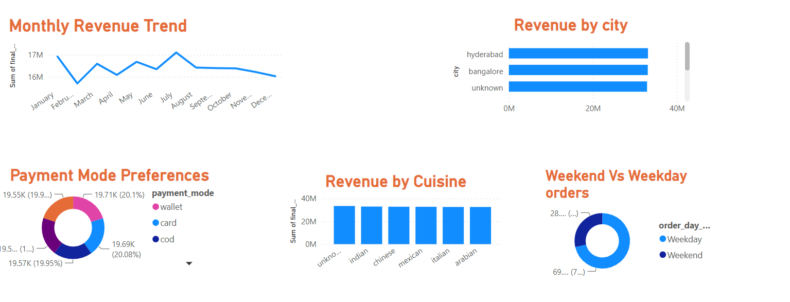
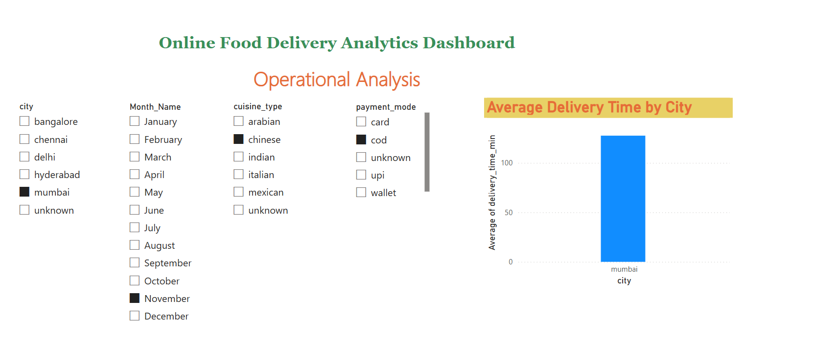
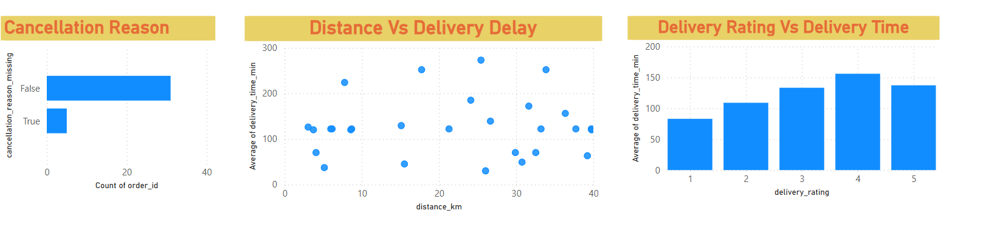

# Online_FoodDeliveryAnalytics Dashboard
An end-to-end data analytics project focused on analyzing online food delivery data using PostgreSQL, SQL, Power BI, and DAX.

I used PostgreSQL and SQL queries for data exploration, data analysis, and business insights. The cleaned dataset was then connected to Power BI to create an interactive dashboard using DAX measures, data modeling, and visual analytics.

The project analyzes revenue trends, customer behavior, delivery performance, cancellation patterns, cuisine and city performance, and operational insights.
## Dashboard Preview

### Summary Dashboard

### Operational Analysis

## Delivery Performance

- Average delivery time by city
- Distance vs delivery delay analysis
- Delivery rating vs delivery time
- Cancellation reason analysis

## Contact

[LinkedIn Profile](https://www.linkedin.com/in/indiralatha-venkatesh/)

